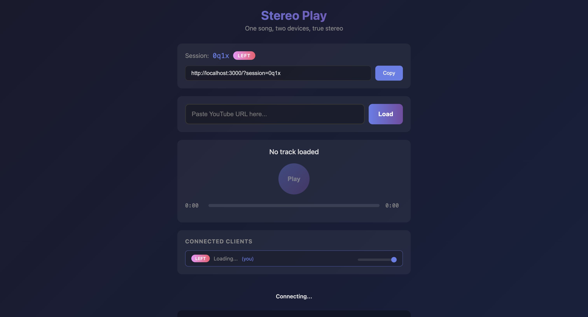

# Stereo Play

> One song, two devices, true stereo

Turn multiple devices into a synchronized stereo system. Each device plays a different audio channel (left/right), creating an immersive stereo experience across your phones, tablets, or computers.



## Features

- **Channel Separation** - Split stereo audio into left/right mono channels
- **Synchronized Playback** - All devices stay perfectly in sync via WebSocket
- **YouTube Support** - Paste any YouTube URL to play
- **Peer Model** - All clients have equal control (play, pause, seek, volume)
- **Loop Mode** - Music plays continuously in repeat mode
- **Per-Channel Volume** - Adjust volume for each channel independently
- **Background Playback** - Handles browser tab throttling gracefully
- **iOS Support** - Audio unlock on first user interaction

## Quick Start

```bash
# Install dependencies
npm install

# Start development server
npm run dev
```

Open http://localhost:3000 on your first device, then share the session link with your second device.

## How It Works

1. Open the app on two devices
2. One device gets the **left** channel, the other gets **right**
3. Paste a YouTube URL to load a track
4. Press play - both devices play in perfect sync
5. Position your devices for stereo separation

## Architecture

- **Backend**: Fastify + WebSocket for real-time sync
- **Audio Processing**: yt-dlp (YouTube download) + FFmpeg (channel separation)
- **Frontend**: Vanilla JS with Web Audio API
- **Sync**: Server-coordinated timestamps with latency compensation

## Requirements

- Node.js 18+
- FFmpeg (for audio processing)
- yt-dlp (for YouTube downloads)

## License

MIT
